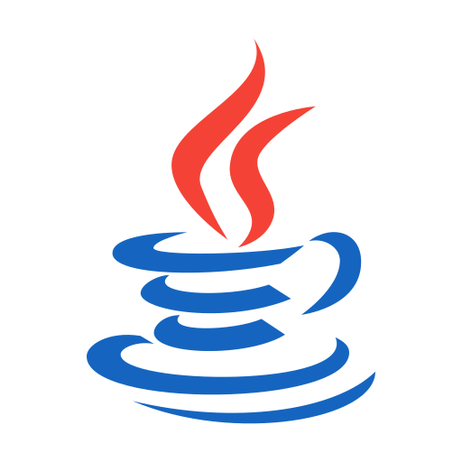

<!-- Reference:
https://github.com/othneildrew/Best-README-Template -->

<!-- PROJECT LOGO -->
 

  <h1><i>Blockchain Simulation</i></h1>

  
  
  .

  

    Simulating a transaction-based ledger on a blockchain in a multi-threaded environment !
  

 
 

<!-- TABLE OF CONTENTS -->

  
Table of Contents

  <ol>
    <li><a href="#about-the-project">About The Project</a></li>
    <li><a href="#built-with">Built With</a></li>
    <li><a href="#getting-started">Getting Started</a></li>
    <li><a href="#license-or-author">License or Author</a></li>
    <li><a href="#contact">Contact</a></li>
    <li><a href="#acknowledgments">Acknowledgments</a></li>
  </ol>

 

<!-- ABOUT THE PROJECT -->
## About The Project
- Simulating the implementation of a transaction-based ledger in a distributed (and decentralized) blockchain.
- The simulations include transactions-handling & block-creation in a multi-threaded environment, with consensus mechanisms mitigating Byzantine attacks

  
(<a href="#readme-top">back to top</a>)

## Built With
  &nbsp; &nbsp; &nbsp; &nbsp;  &nbsp; &nbsp; &nbsp; &nbsp; &nbsp; &nbsp; 

  &nbsp; &nbsp; &nbsp; &nbsp; &nbsp; &nbsp; &nbsp; <b><i> Java </i></b> &nbsp; &nbsp; &nbsp; &nbsp; &nbsp; &nbsp; &nbsp; &nbsp; &nbsp; &nbsp; &nbsp; <b><i> IntelliJ </i></b>

  
(<a href="#readme-top">back to top</a>)

<!-- GETTING STARTED -->
## Getting Started
  #### Prerequisites
  * Java 21 or higher
  * Dependencies (Configured in each application)
  * IDE - IntelliJ (Preferred)
  * Minimum - 8GB RAM, Intel i7 CPU (or Equivalent)

  #### Setup & Use
  * **_Transaction Based Ledger_**
	1. Clone the repo
	2. Open IntelliJ  ->  Go to `Open Project`
	3. Go to the cloned repo -> Select `BlockchainAsATransactionBasedLedger`
	4. Test & Run
  * **_Consensus Mechanism_**
	1. Clone the repo
	2. Open IntelliJ  ->  Go to `Open Project`
	3. Go to the cloned repo -> Select `ConsensusMechanism`
	4. Test & Run

  
(<a href="#readme-top">back to top</a>)

<!-- LICENSE -->
## License or Author
  * Uditya Laad

  
(<a href="#readme-top">back to top</a>)

<!-- CONTACT -->
## Contact
  <b>Uditya Laad</b> &nbsp; [@linkedin.com/in/uditya-laad-222680148](https://www.linkedin.com/in/uditya-laad-222680148/)
  
  &nbsp; &nbsp; &nbsp; &nbsp; &nbsp; &nbsp; &nbsp; &nbsp; &nbsp; &nbsp; &nbsp; [@github.com/udityalaad](https://github.com/udityalaad)
  
  &nbsp; &nbsp; &nbsp; &nbsp; &nbsp; &nbsp; &nbsp; &nbsp; &nbsp; &nbsp; &nbsp; udityalaad123@gmail.com

  <b>Project Link</b> &nbsp; [https://github.com/udityalaad/BlockchainAsTransactionLedger](https://github.com/udityalaad/BlockchainAsTransactionLedger)

  
(<a href="#readme-top">back to top</a>)

<!-- ACKNOWLEDGMENTS -->
## Acknowledgments
  * [Open Source Stack, Openzeppelin](https://www.openzeppelin.com/open-source-stack)
  * [Remix Resources](https://remix-project.org/?lang=en)
  * [github.com/othneildrew/Best-README-Template/](https://github.com/othneildrew/Best-README-Template)
  * [Blockchain Wallpaper, Forbes](https://www.forbes.com/sites/digital-assets/article/what-is-a-blockchain/)

  
(<a href="#readme-top">back to top</a>)

